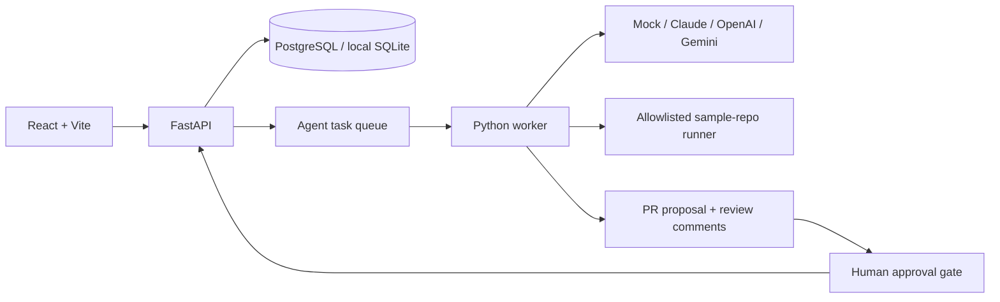

# Architecture

The API owns task, workflow, review, sandbox-run, and quality-metric records. The worker polls queued tasks, records structured plan/proposal/test outputs, and creates a review. A review decision advances task and workflow state. The mock provider is the zero-configuration default. API and worker share the same database and bundled sample repository.

SQLite is intended for local development. Railway deployments use the managed PostgreSQL URL and apply schema revisions with Alembic before starting the API. The worker waits for the database schema to become available.
